# Lyricorder

Your Lyrics and Records made simple.

## Getting Started

This project was created with learning purposes.


### Installing

```
npm install
```


## Deployment

For browser deployment. (audio recording not available)

```
ionic serve
```

For mobile deployment.
```
ionic cordova build android --prod
```


## Built With

* [Ionic 3](https://ionicframework.com/) 
* [Angular 4](https://angular.io/) 
* [PouchDB](https://pouchdb.com/)
* [RecordRTC](https://recordrtc.org/)
* [wavesurfer.js](https://wavesurfer-js.org/)


## Features

Main screen

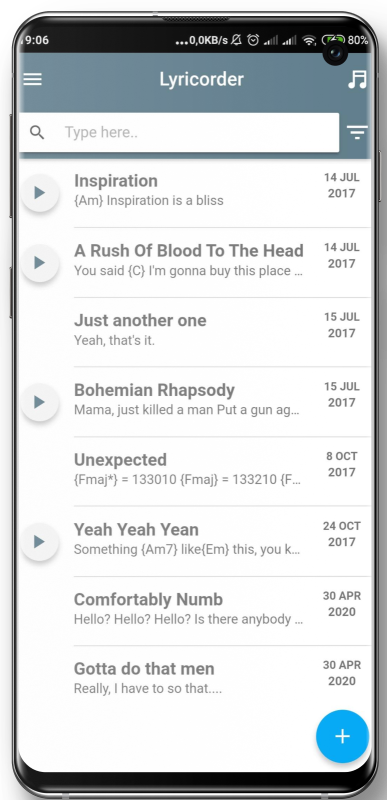

Built-in player for last recorded file

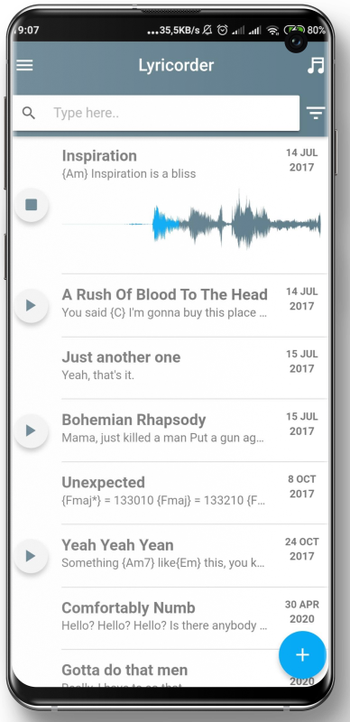

Filtering and Ordering options

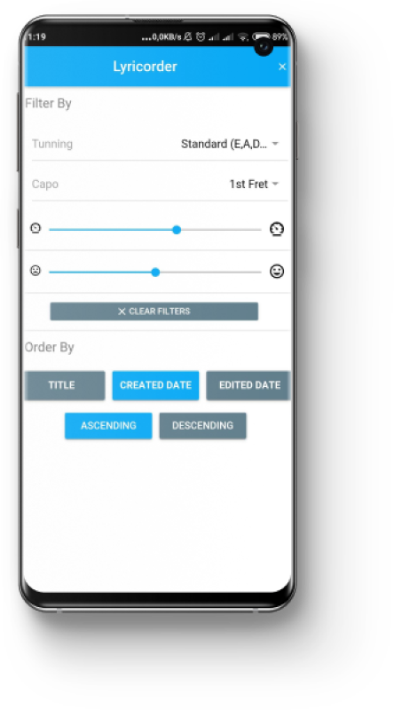

Lyric View mode

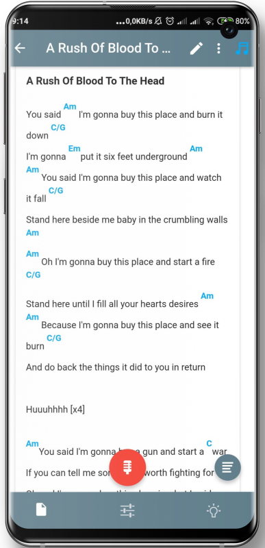


Lyric Edit mode - To define a chord use between curly brackets. Eg: {Am}

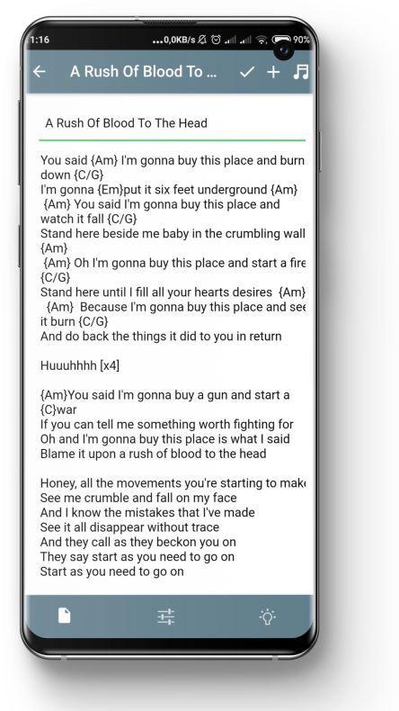


Built-in player and recorder

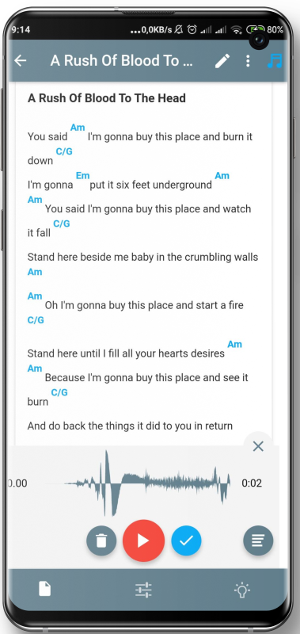

Records List

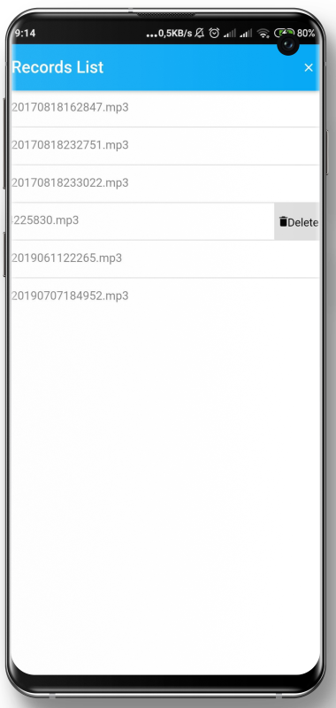

Song Properties tab


Ideas Tab - Feeling related words 

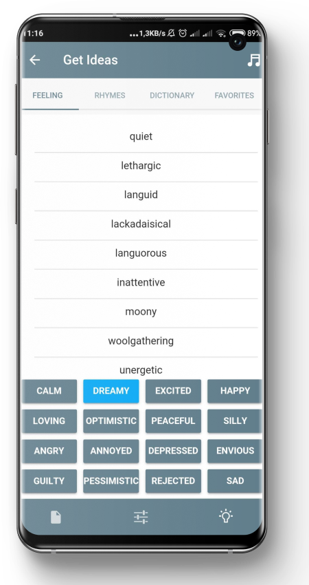

Ideas Tab - Rhymes

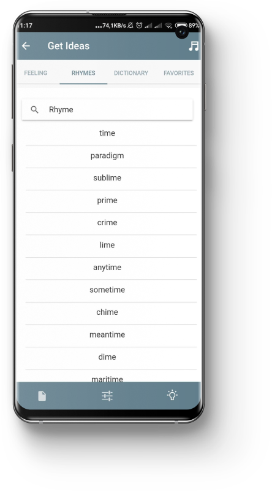

Ideas Tab - Favorites

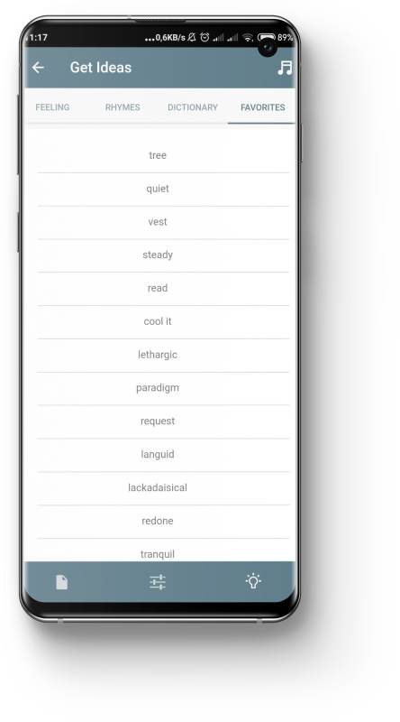

Environment Sounds - Set relaxing sounds that will keep playing while you write

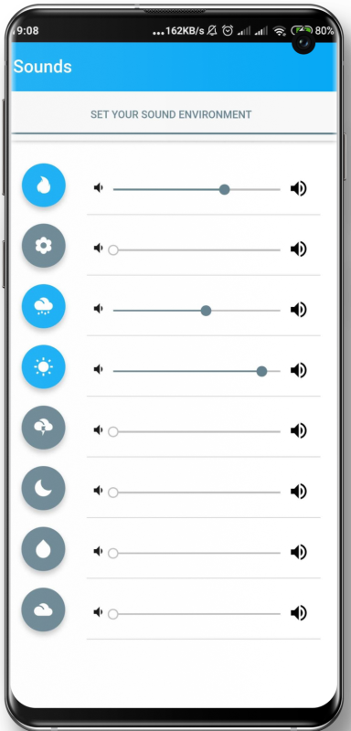

Side Screen

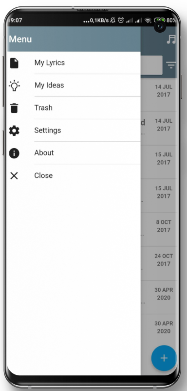

Trash - The lyrics will be permanently deleted after the define period on settings 

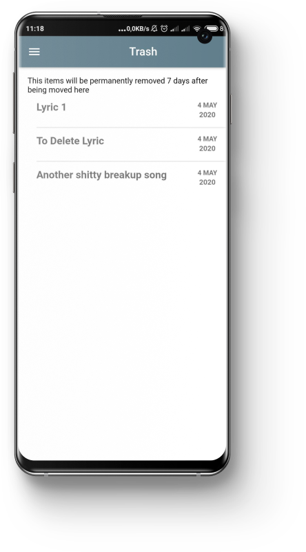

Settings

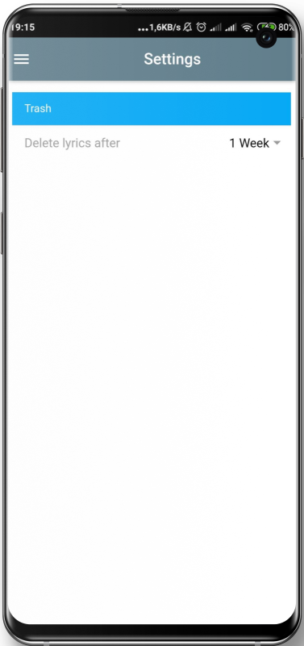

