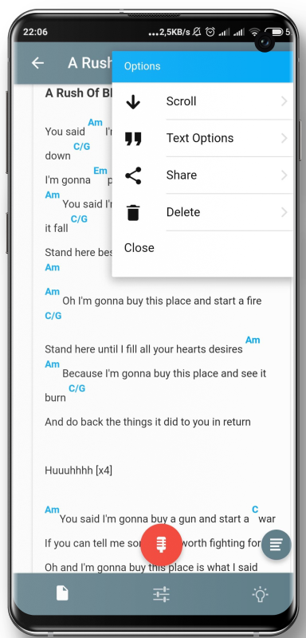
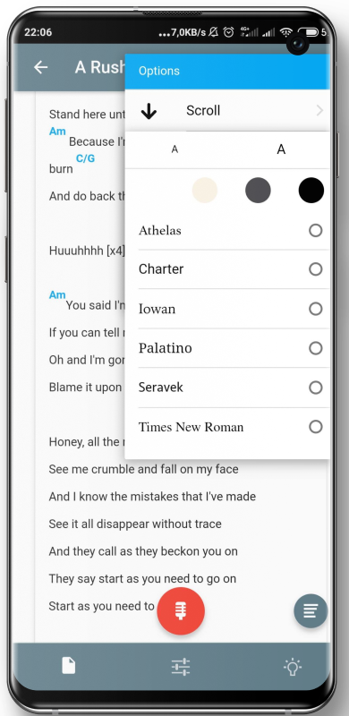
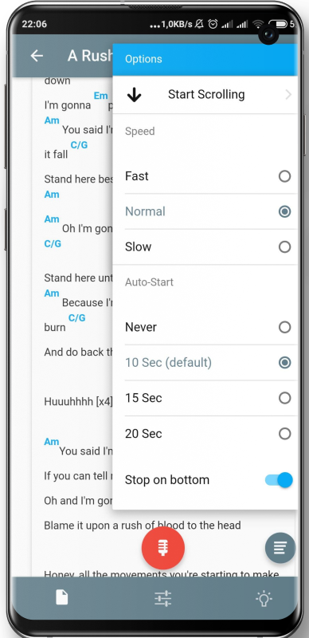
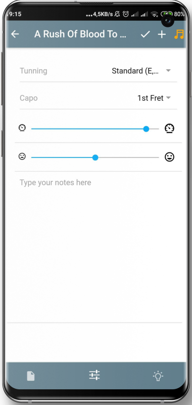

# Lyricorder

Your Lyrics and Records made simple.
Main features:
* Lyric Editor with chords highlight
* Built-in player and Recorder
* Environment sounds 
* Rhymes, Dictionary and Mood related words


## Summary

This project was created with learning purposes. Was developed years ago while learning Ionic 3 but just recently uploaded.
That means that a lot of things would be done different now, as always. Besides that, a lot of working functionality.

## TODOs

* Authentication: With an authentication system we can provide synchronization funtionality to the user if using multiple devices. PouchDB was chosed for the synchronization hability.
* Add more options during edition like having a Chord selector helper.
* Folders creation.


### Installing

```
npm install
```


## Deployment

For browser deployment. (audio recording not available)

```
ionic serve
```

For mobile deployment. 
```
ionic cordova build android --prod
```
Never deployed it for iOS but i believe Ionic will handle it just right.


## Built With

* [Ionic 3](https://ionicframework.com/) 
* [Angular 4](https://angular.io/) 
* [PouchDB](https://pouchdb.com/)
* [RecordRTC](https://recordrtc.org/)
* [wavesurfer.js](https://wavesurfer-js.org/)


## Features

Main screen


Built-in player for last recorded file


Filtering and Ordering options


Lyric View mode


Options Menu  |  Text Options | Scroll Options
:-------------------------:|:-------------------------:|:-------------------------:
  |  | 


Lyric Edit mode - To define a chord use between curly brackets. Eg: {Am}


Built-in player and recorder


Records List


Song Properties tab - Tunning, Capo, Speed and Mood



Ideas Tab - Feeling related words 


Ideas Tab - Rhymes - Find rhymes for a specific word


Ideas Tab - Favorites - All the words can be favourited and will appear here


Environment Sounds - Set relaxing sounds that will keep playing while you write and record


Side Screen


Trash - The lyrics will be permanently deleted after the defined period on settings 


Settings


